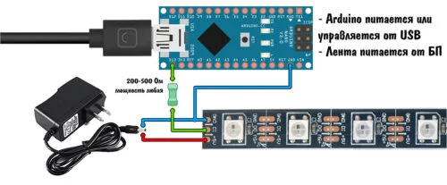

# Хамелион
Данное программное обеспечение предназначено для управления адресной светодиодной лентой с помощью мокроконтроллерной платформы Arduino

Содержание

<ol>
    <li>
        <a href="#user-instruction">Инструкция пользователя</a>
        <ul>
            <li><a href="#controller-connect">Сборка и прошивка контроллера</a></li>
        </ul>
        <ul>
            <li><a href="#first-entry">Первый вход в приложение (Знакомство с интерфесом)</a></li>
        </ul>
    </li>
    <li>
        <a href="#creator-instruction">Инструкция для разработчиков</a>
        <ul>
            <li><a href="#user-instruction">Знакомство со структурой проекта</a></li>
        </ul>
        <ul>
            <li><a href="#user-instruction">Доработка скетча</a></li>
        </ul>
        <ul>
            <li><a href="#user-instruction">Доработка приложения</a></li>
        </ul>
        <ul>
            <li><a href="#user-instruction">Доработка функционала общения с контроллером</a></li>
        </ul>
    </li>
</ol>

## User instruction
### Controller connect
Если вы первый раз работаете с Arduino рекомендую к прочтению статью по <a href="https://alexgyver.ru/lessons/before-start/">Ссылке</a>. 
__Для того чтоб убедиться в отсутствии проблем прошивки, запишите стандартную прошивку предоставляемую Arduino IDE__

Далее нам понадобится библиотека __FastLed.h__ (Единственная библиотека используемая в прошивке) <a href="https://github.com/FastLED/FastLED/releases/tag/3.6.0">версия исопльзуемая на момент написания</a>. Подключаем  бибилиотеку с помощью 

>Скетч -> Бибилотеки -> Добавить библиотеку .zip

Далее скачиваем прошивку (На вкладке релизов репозитория файл __main-arduino.zip__)

Компилируем проошивку - всё гуд если всё гуд!

Рекомендуется изменить в фале main.ino:
1. Строка 3, цифра - количество светодиодв
2. Строка 4, цифра - имя контакта к которому подключена лента

3. Строка 25, цифра - количество мячиков в последнем режиме (естественно если вы не собираетесь исопльзовать этот режим, можно ничего не трогать этот параметр)
4. Строка 36, символы WS2812 ваш чип ленты входящий в список доступных библиотеки FastLed

    
Ошибка прошивки: Библиотека не найдена (windows)

    При стандартном подключении бибиотеки у меня возникла такая ошибка, иправил тем что перенёс распакованную бибилиотеку в корень стандартых библиотек Arduino IDE

    Распакованная библиотека - Documents->Arduino-> libraries->FastLed-master

    Стандартные библиотеки - ../Arduino/Lib/

 

После прошивки подключаем контроллер по следующей схеме:

__Другие схемы подключения могутнавредить контроллеру!__

P.S. Но я использую без резистера, посмотрим через сколько отвалится ножка контроллера

расчёт мощьности блока питания для стабильной работы вы можете сделать <a href="https://alexgyver.ru/other/led_calc.html">здесь</a>

> Стоит отметить что стандартная прошивка для WS2812 от AlexGaver здесь не подойдёт. Она была взята за основу, но полностью переписана и оптимизированна, за счёт чего при стандартной прошивке из репозитория вы можете подключать до 400 свтодиодов (чипов) по сравнению с 200 у Гавера

### First Entry

#### Установка приложения

>Если вы пользователь Windows 

#### Запуск

Нажмите на название своей ОС Для открытия подробной инструкции

    
Windows

    

    рекомендуется ставть программу в папку ProgramFiles. Лучше используйте папку пользователя. Иначе могут возникнуть проблемки.

    Запуск происходит стандартно, но если что-то идёт не так, рекомендуется производить запуск от имени администратора

    При входе необзодимо указать порт к которому подключен контроллер.
    
    В нашем случае это любой кроме COM1

    
Linux

    
    Запуск производить только из под sudo. В инном случае по нажатию на любую кнопку приложение будет вылетать из-за отсутствия прав для работы с COM портами

    При входе необзодимо указать порт к которому подключен контроллер.

    В нашем слуае это любой в пути которого есть "USB"

#### Знакомство с интерфесом

Итак, интерфес разделён на функциональные части.

.png>)

Временные - настройки применённые этими кнопками не сохраняются при перезапуске приложения. Из функциональных клавишь 
<ol>
    <li>
        Следующий/Предыдущий - переключают режимы
    </li>
    <li>
        Stop/Continue - Заголовки кнопкок переключаются. приостанавливает режим и не даёт ленте изменять цвета
    </li>
    <li>
        ON/OFF - вкл/выкл. Тут всё очевидно
    </li>
    <li>
        В право/В лево - включает режим которые перемещает текущие свтодиоды в соответствующее направление
    </li>
    
</ol>

Центр
<ol>
    <li>
        О программе - на данны момент перекидывает на страницу первой версии проекта. На данны момент не функционирует
    </li>
    <li>
        Название режима
    </li>
    <li>
        Описание режима
    </li>
    <li>
        Применить - передаёт текущий режим на ленту (сделано через кнопку т.к. есть мерцающие режимы режущие глаз)
    </li>
</ol>

Функицональная часть!
<ol>
    <li>
    Режимы - список режимов которые можно применить
    </li>
</ol>

Параметры

Данные в этом блоке применяются моментально на контроллере
<ol>
    <li>
        Время задержки - каждый режим прогоняется заново в зависимости изменяя параметры. Между каждым шагом етсь задержки. При увеличении задержки режим будет проходить медленнее, и наоборот (в последнем режиме рекомендуется указать задержку 0)
    </li>
    <li>
        Яркость - Задаётся значением от 0 до 255
    </li>
    <li>
        Цвет - режимы где используется 1 цвет позволяют использовать любой цвет. При изменении поле становится активным и не активным в зависимотсти от возможности регулировать данный параметр
    </li>
</ol>

## Creator instruction

В процесс резработки